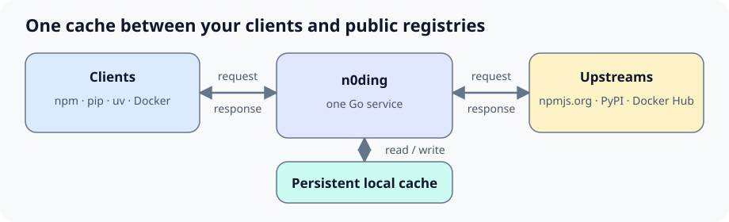
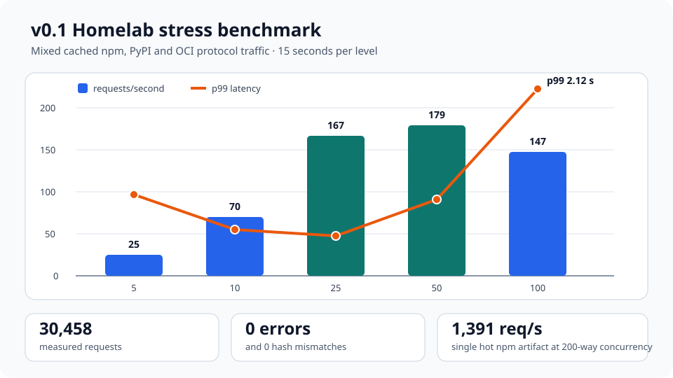

# n0ding: lightweight artifact caching for npm, PyPI, and OCI

[](https://github.com/HN-Tran/n0ding/actions/workflows/ci.yml)
[](LICENSE)


**n0ding is an open-source, self-hosted pull-through cache for npm, pip/uv,
and Docker/OCI downloads.** It gives homelabs, CI runners, developer
workstations, and small teams one small service and one persistent cache.



| Ecosystem | Client path | Cached content |
|---|---|---|
| npm | `/npm/` | Package metadata and tarballs |
| PyPI | `/pypi/simple/` | Simple API pages, wheels, source archives, and metadata |
| Docker / OCI | `/v2/` | Indexes, manifests, configs, and blobs |

> [!WARNING]
> **v0.1 is a public preview.** Keep the default deployment on localhost or a
> trusted network. n0ding has no built-in users or RBAC and is not a
> production supply-chain security service.

## Quick start

Requirements: Docker Engine or Docker Desktop with Compose v2.

Linux and macOS:

```sh
curl -fsSLO https://github.com/HN-Tran/n0ding/releases/download/v0.1.0/install.sh
sh install.sh
```

Windows PowerShell:

```powershell
Invoke-WebRequest https://github.com/HN-Tran/n0ding/releases/download/v0.1.0/install.ps1 -OutFile install.ps1
& .\install.ps1
```

The installer verifies checksums, pulls the pinned multi-architecture image,
binds n0ding to `127.0.0.1:8080`, and waits for the health check. It does not
change client settings.

Verify the service:

```sh
curl http://localhost:8080/healthz
curl http://localhost:8080/api/v1/status
```

<a id="client-setup"></a>
Then point any clients you want to cache at n0ding:

```sh
npm config set registry http://localhost:8080/npm/
python -m pip install --index-url http://localhost:8080/pypi/simple/ requests
uv pip install --index-url http://localhost:8080/pypi/simple/ requests
docker pull localhost:8080/library/alpine:3.20
```

Docker requires the local insecure-registry exception described in the
[client setup guide](docs/client-setup.md). For shared or
internet-reachable deployments, use TLS and the
[authenticated public deployment profile](docs/public-vps.md).

## Why n0ding

- One Go binary, one TOML file, and no external database.
- One operational surface for npm, PyPI, and OCI pull traffic.
- Standard npm, pip, uv, and Docker clients; no client plugin required.
- Persistent filesystem caching with age and shared-size retention controls.
- Health, JSON status, and Prometheus-compatible metrics endpoints.
- Docker Compose deployment and Linux AMD64/ARM64 images.
- Read-only package loading by default. Private PyPI publishing is an explicit,
  single-token private-self-use option.

## Measured behavior



A post-release Homelab reference run completed **30,458 cached npm, PyPI, and
OCI protocol requests with zero HTTP errors or response hash mismatches**.
Mixed traffic peaked around 179 requests/second on that host; one hot npm
artifact reached 1,391 requests/second. These are installation-specific
observations, not production guarantees.

Read the [method, complete results, and limitations](docs/stress-benchmark-2026-08-16.md)
and the [real-client compatibility evidence](docs/compatibility.md).

## Scope and limitations

n0ding is deliberately narrower than a full repository manager:

- It is not an offline mirror. OCI cache hits still require an upstream
  authorization and digest check.
- It has no built-in client authentication, user management, RBAC, scanning,
  signing, or policy engine.
- npm and OCI publishing are unsupported. PyPI publishing is opt-in and meant
  for trusted private self-use.
- Maven, NuGet, Helm, Podman, object storage, and multi-writer cache access are
  not supported.
- Only one n0ding process may write to a cache directory.
- Retention limits are logical cache controls, not filesystem quotas. Monitor
  free space during repeated preview use.

See [known operational constraints](docs/operations.md), the
[threat model](docs/threat-model.md), and the
[Public Preview release gate](docs/v0.1-release-gate.md) before deployment.

## Documentation

| Topic | Guide |
|---|---|
| Install, upgrades, backup, uninstall | [Deployment](docs/deployment.md) |
| npm, pip, uv, and Docker client configuration | [Client setup](docs/client-setup.md) |
| Internet-facing deployment with mTLS | [Public VPS](docs/public-vps.md) |
| Configuration and retention | [Configuration](docs/configuration.md) |
| Monitoring and troubleshooting | [Operations](docs/operations.md) · [Troubleshooting](docs/troubleshooting.md) |
| Architecture and security boundaries | [Architecture](docs/architecture.md) · [Threat model](docs/threat-model.md) |
| Test and compatibility evidence | [Compatibility](docs/compatibility.md) · [v0.1 gate](docs/v0.1-release-gate.md) |

## Build and contribute

```sh
docker compose up --build -d
curl http://localhost:8080/healthz
```

For local Go development:

```sh
go test ./...
go vet ./...
go build -trimpath -o dist/n0ding ./cmd/n0ding
```

See [CONTRIBUTING.md](CONTRIBUTING.md) and the
[architecture guide](docs/architecture.md) for development details.

## Security and license

Read [SECURITY.md](SECURITY.md) before deployment or disclosure. n0ding is
licensed under [Apache-2.0](LICENSE).
